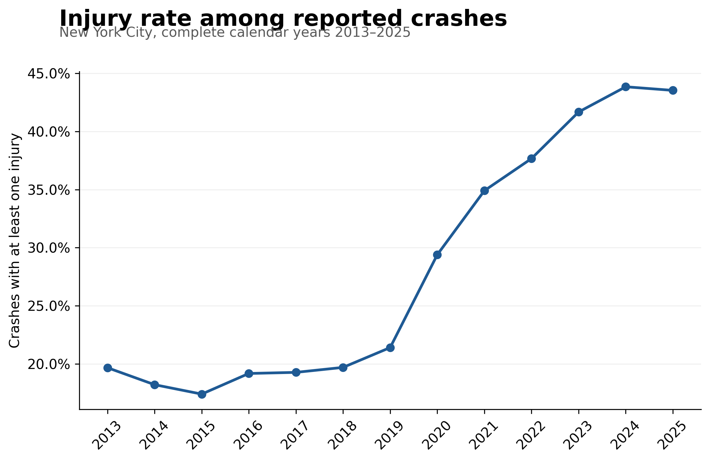

# Injury Risk in New York City Traffic Crashes

[](https://github.com/9-zero/nyc-crash-injury-risk/actions/workflows/tests.yml)

An end-to-end R study of when and where police-reported New York City crashes
involve injury. The project combines reproducible data acquisition, explicit
cleaning rules, descriptive analysis, year-stratified bootstrap inference,
logistic regression, a Quarto report, unit tests, and an interactive Shiny
dashboard.

> **Research question:** How are time of day and borough associated with the
> probability that a police-reported NYC crash results in at least one injury?



## Key findings

- The analysis covers **2,132,144** reported crashes from complete calendar
  years 2013-2025; **24.54%** involved at least one reported injury.
- The injury share rose sharply after 2019, from 21.4% in 2019 to 29.4% in 2020
  and 43.5% in 2025. This is a structural pattern in reported crash records,
  not evidence of a particular policy effect.
- In the prespecified comparison, rush hours (7:00-9:59 and 16:00-18:59) had
  an injury rate **0.94 percentage points lower** than non-rush hours in the
  5% year-balanced sample (1,000-replicate stratified-bootstrap 95% interval:
  -1.49 to -0.39 percentage points).
- Full-data injury rates were highest in Brooklyn (26.5%) and the Bronx (25.7%)
  and lowest in Manhattan (19.4%). These comparisons do not control for travel
  volume, road design, speed, or crash-reporting differences.

All findings are descriptive or associational. The crash file has no exposure
denominator, so the project does not estimate risk per trip, mile traveled, or
resident and does not interpret regression coefficients causally.

## What this repository demonstrates

- Reproducible acquisition from the official Socrata API, with an optional
  local-CSV import route for the full NYC Open Data export
- Defensive parsing, schema validation, deduplication, missing-data rules, and
  unit tests for critical transformations
- A fixed 5% random sample within every year for computationally intensive
  inference, plus a documented full-data/sample balance check
- Year-stratified bootstrap intervals and a logistic model with calendar-year
  fixed effects
- Publication-ready graphics that emphasize estimands and denominators
- A filterable Shiny dashboard with year and borough controls, including a
  responsive NYC crash-density map built from committed aggregate cells rather
  than the 450MB source file

## Repository map

```text
R/                       Reusable acquisition, cleaning, analysis, and plot functions
scripts/                 Numbered end-to-end pipeline
analysis/report.qmd      Reproducible research report
app/                     Interactive Shiny dashboard
data/raw/                Cached source data (not tracked)
data/processed/          Analysis datasets (not tracked)
outputs/figures/         Publication-ready figures
outputs/tables/          Reviewable result tables and dashboard aggregates
outputs/models/          Fitted model objects (not tracked)
tests/testthat/          Unit tests for cleaning and analysis logic
```

## Run the dashboard

The committed aggregate results are sufficient to launch the dashboard without
downloading crash-level data:

```r
source("scripts/00_setup.R")
shiny::runApp("app")
```

The filters recompute crash counts, injury rates, mean injuries, annual trends,
borough comparisons, and time-of-day comparisons from additive sufficient
statistics. The spatial tab independently filters the NYC density map by year
and reported borough. The model and bootstrap tabs show the prespecified
inferential results.

## Deploy the public dashboard

The deployment script creates a self-contained bundle with only the Shiny app
and its four aggregate result tables; it never uploads the crash-level source
file. To publish on [shinyapps.io](https://www.shinyapps.io/):

1. Create a shinyapps.io account and add an account token from the dashboard.
2. Copy the generated `rsconnect::setAccountInfo(...)` command into a local R
   console. Do not save the token or secret in this repository.
3. From the repository root, run:

```r
install.packages("rsconnect")
Sys.setenv(SHINYAPPS_ACCOUNT = "your-shinyapps-account-name")
source("scripts/04_deploy_app.R")
```

The public URL will follow the form
`https://your-shinyapps-account-name.shinyapps.io/nyc-crash-injury-risk/`.
Run the deployment script again whenever the app or committed aggregate tables
change.

## Reproduce the full analysis

The project targets R 4.3 or later. From the repository root:

```r
source("scripts/00_setup.R")
source("scripts/run_all.R")
```

By default, the pipeline downloads 2013-2025 from the
[official NYC Open Data table](https://data.cityofnewyork.us/Public-Safety/Motor-Vehicle-Collisions-Crashes/h9gi-nx95)
and caches each year locally. To use a downloaded CSV instead:

```r
Sys.setenv(NYC_CRASH_CSV = "/path/to/Motor_Vehicle_Collisions_-_Crashes.csv")
source("scripts/run_all.R")
```

Then render the research report from a terminal with:

```bash
quarto render analysis/report.qmd
```

Optional environment variables:

| Variable | Purpose | Default |
| --- | --- | --- |
| `NYC_CRASH_CSV` | Use a local full-data export instead of the API | unset |
| `NYC_OPEN_DATA_APP_TOKEN` | Increase Socrata API rate limits | unset |
| `REFRESH_DATA` | Replace existing yearly cache files when `true` | `false` |
| `BOOTSTRAP_REPS` | Number of year-stratified bootstrap replicates | `1000` |

## Analysis design

The primary outcome, `injury_crash`, equals one when the reported number of
injured persons is greater than zero. Missing injury counts remain missing;
they are not silently converted to zero. Descriptive summaries use all cleaned
records. The regression and bootstrap use a fixed 5% sample within calendar
year (seed 2026), preserving the study period's annual composition.

The logistic model includes time band, borough, weekend status, and categorical
calendar-year fixed effects. Midday, Manhattan, weekdays, and 2013 are the
reference categories. See [CODEBOOK.md](CODEBOOK.md) for variable definitions
and `analysis/report.qmd` for the complete interpretation and limitations.

## Limitations

- The source covers police-reported crashes and may omit unreported events.
- Borough is missing for a substantial share of records.
- Traffic exposure, speed, weather, road design, and vehicle mix are unavailable
  or not modeled.
- Injury, location, and contributing-factor fields may contain reporting or
  measurement error.
- Large samples yield narrow intervals but do not solve selection, measurement,
  or causal-identification problems.

## Author

9_zero
